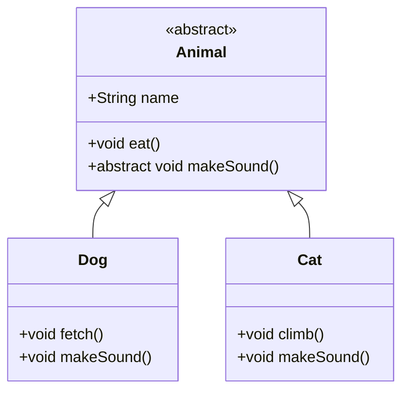

# 面向对象编程（OOP）详解

> 面向对象编程（Object-Oriented Programming）是一种强大的编程范式，它将现实世界概念映射到代码结构中。作为Java初学者，掌握OOP是理解Java核心思想的关键。

## 一、OOP基本概念

### 1. 对象（Object）
- **定义**：现实世界中具体存在的实体
- **示例**：
    - 物理实体：汽车、学生、订单
    - 逻辑实体：银行账户、图形界面按钮

### 2. 类（Class）
- **定义**：创建对象的蓝图或模板
- **特点**：
    - 定义对象的属性（数据）和行为（方法）
    - 是抽象的概念，对象是具体的实例

```java
// 类定义示例
public class Car {
    // 属性（字段）
    String brand;
    int year;
    double price;
    
    // 行为（方法）
    void startEngine() {
        System.out.println("Engine started!");
    }
    
    void accelerate(int speed) {
        System.out.println("Accelerating to " + speed + " km/h");
    }
}
```

## 二、OOP四大核心特性

### 1. 封装（Encapsulation）
- **核心思想**：隐藏对象的内部实现细节，仅暴露必要接口
- **实现方式**：
    - 使用访问修饰符控制可见性
    - 提供getter/setter方法访问私有属性

```java
public class BankAccount {
    // 私有属性（外部无法直接访问）
    private double balance;
    
    // 公开方法（外部访问接口）
    public void deposit(double amount) {
        if (amount > 0) {
            balance += amount;
        }
    }
    
    public double getBalance() {
        return balance;
    }
}
```

### 2. 继承（Inheritance）
- **核心思想**：子类继承父类的属性和方法，实现代码复用
- **Java实现**：`extends`关键字

```java
// 父类
public class Animal {
    String name;
    
    public void eat() {
        System.out.println(name + " is eating.");
    }
}

// 子类
public class Dog extends Animal {
    public void bark() {
        System.out.println("Woof! Woof!");
    }
}

// 使用
Dog myDog = new Dog();
myDog.name = "Buddy";
myDog.eat();  // 继承自Animal类
myDog.bark(); // Dog类特有方法
```

### 3. 多态（Polymorphism）
- **核心思想**：同一操作作用于不同对象，产生不同行为
- **实现方式**：
    - 方法重写（Override）
    - 父类引用指向子类对象

```java
public class Animal {
    public void makeSound() {
        System.out.println("Animal makes a sound");
    }
}

public class Cat extends Animal {
    @Override
    public void makeSound() {
        System.out.println("Meow!");
    }
}

public class Duck extends Animal {
    @Override
    public void makeSound() {
        System.out.println("Quack!");
    }
}

// 多态示例
Animal myPet = new Cat();
myPet.makeSound(); // 输出: Meow!

myPet = new Duck();
myPet.makeSound(); // 输出: Quack!
```

### 4. 抽象（Abstraction）
- **核心思想**：关注对象做什么，而不是如何做
- **实现方式**：
    - 抽象类（abstract class）
    - 接口（interface）

```java
// 抽象类示例
public abstract class Shape {
    // 抽象方法（无实现）
    public abstract double calculateArea();
    
    // 具体方法
    public void display() {
        System.out.println("This is a shape");
    }
}

// 接口示例
public interface Drawable {
    void draw(); // 隐式抽象方法
    default void setColor(String color) { // 默认方法
        System.out.println("Setting color to " + color);
    }
}

// 实现
public class Circle extends Shape implements Drawable {
    private double radius;
    
    public Circle(double r) {
        radius = r;
    }
    
    @Override
    public double calculateArea() {
        return Math.PI * radius * radius;
    }
    
    @Override
    public void draw() {
        System.out.println("Drawing a circle");
    }
}
```

## 三、OOP关键概念详解

### 1. 构造方法（Constructor）
- 特殊方法，用于初始化新创建的对象
- 特点：
    - 与类同名
    - 无返回类型
    - 可重载（多个参数不同的构造方法）

```java
public class Student {
    String name;
    int id;
    
    // 默认构造方法
    public Student() {
        name = "Unknown";
        id = 0;
    }
    
    // 带参数构造方法
    public Student(String name, int id) {
        this.name = name; // this指代当前对象
        this.id = id;
    }
}
```

### 2. this关键字
- 指代当前对象实例
- 主要用途：
    - 解决局部变量与成员变量命名冲突
    - 调用其他构造方法（必须作为构造方法的第一条语句）

```java
public class Rectangle {
    int width, height;
    
    public Rectangle() {
        this(10, 10); // 调用另一个构造方法
    }
    
    public Rectangle(int width, int height) {
        this.width = width;
        this.height = height;
    }
}
```

### 3. 访问修饰符
| 修饰符     | 同类 | 同包 | 子类 | 其他包 |
|------------|------|------|------|--------|
| `public`   | ✓    | ✓    | ✓    | ✓      |
| `protected`| ✓    | ✓    | ✓    | ✗      |
| 默认       | ✓    | ✓    | ✗    | ✗      |
| `private`  | ✓    | ✗    | ✗    | ✗      |

### 4. static关键字
- 静态成员属于类而非对象
- 特点：
    - 静态变量：所有对象共享同一份副本
    - 静态方法：只能访问静态成员，不能使用`this`
    - 静态代码块：类加载时执行一次

```java
public class Counter {
    static int count = 0; // 静态变量
    
    Counter() {
        count++;
    }
    
    static void displayCount() { // 静态方法
        System.out.println("Total objects: " + count);
    }
    
    static { // 静态代码块
        System.out.println("Counter class initialized");
    }
}
```

## 四、OOP设计原则

### 1. SOLID原则
| 原则 | 全称 | 解释 |
|------|------|------|
| S | 单一职责原则 | 一个类只负责一个功能领域 |
| O | 开闭原则 | 对扩展开放，对修改关闭 |
| L | 里氏替换原则 | 子类必须能替换其父类 |
| I | 接口隔离原则 | 使用多个专用接口优于一个通用接口 |
| D | 依赖倒置原则 | 依赖抽象而非具体实现 |

### 2. 组合优于继承
- 优先使用组合（has-a关系）而非继承（is-a关系）
- 优点：
    - 更高的灵活性
    - 避免继承层次过深
    - 减少耦合

```java
// 使用组合替代继承
public class Engine {
    void start() { /* ... */ }
}

public class Car {
    private Engine engine; // 组合关系
    
    public Car() {
        engine = new Engine();
    }
    
    void start() {
        engine.start();
    }
}
```

## 五、Java OOP最佳实践

1. **封装原则**：
    - 将字段设为private
    - 通过public方法提供访问
    - 在setter方法中添加验证逻辑

2. **继承使用**：
    - 使用继承表示"is-a"关系
    - 避免超过3层的继承深度
    - 考虑使用final类防止继承

3. **接口设计**：
    - 定义清晰的API契约
    - 使用接口实现多继承
    - 优先使用函数式接口（Java 8+）

4. **多态应用**：
    - 使用父类类型引用子类对象
    - 结合工厂模式创建对象
    - 利用策略模式替换条件语句

## 六、OOP常见面试问题

1. 类和对象有什么区别？
2. 重载（Overload）和重写（Override）的区别？
3. 抽象类和接口的区别？
4. 什么是构造函数链？
5. 如何在Java中实现多继承？

> 提示：学习OOP最好的方式是动手实践！尝试创建自己的类层次结构，实现封装、继承和多态。

## 总结
面向对象编程是Java的基石，理解其核心概念对成为优秀Java开发者至关重要。通过封装、继承、多态和抽象，我们可以构建模块化、可重用和易维护的代码系统。不断练习这些概念，你将在Java编程道路上走得更远！



*图：简单的类继承关系示意图*