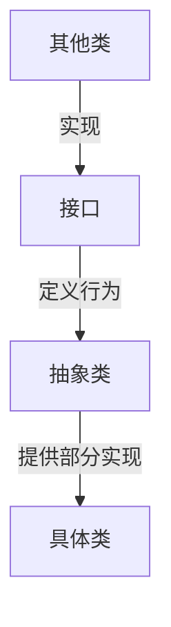

# Java 抽象类与接口对比

在 Java 面向对象编程中，抽象类和接口是实现抽象和多态的两种重要机制。以下是它们的详细对比：

| **特性**             | **抽象类 (Abstract Class)**                  | **接口 (Interface)**                           |
|----------------------|---------------------------------------------|-----------------------------------------------|
| **定义关键字**       | `abstract class`                            | `interface`                                   |
| **方法实现**         | 可包含抽象方法和具体实现方法                | Java 8 前只能有抽象方法，之后可包含默认方法 (`default`) 和静态方法 (`static`) |
| **成员变量**         | 可包含普通成员变量、静态变量和常量          | 只能包含常量 (`public static final` 默认修饰) |
| **构造方法**         | 可以有构造方法（用于子类初始化）            | 不能有构造方法                                |
| **继承/实现方式**    | 单继承（一个类只能继承一个抽象类）          | 多实现（一个类可实现多个接口）                |
| **访问修饰符**       | 方法可以是任意访问修饰符                    | 方法默认 `public`（Java 9 起支持 `private`）  |
| **设计目的**         | 表示 "是什么" (is-a) 关系                   | 表示 "能做什么" (can-do) 关系                 |
| **代码复用**         | 适合在相关类间共享代码                      | 适合定义行为规范                              |
| **版本兼容性**       | 添加新方法会强制所有子类实现                | Java 8+ 可通过默认方法添加新功能而不破坏现有实现 |
| **设计层次**         | 表示类的基本结构                            | 表示类的额外能力                              |

## 详细说明

### 1. 方法实现
- **抽象类**：可同时包含抽象方法（无实现）和具体方法（有实现）
  ```java
  abstract class Animal {
      // 抽象方法
      abstract void makeSound();
      
      // 具体方法
      void sleep() {
          System.out.println("Sleeping...");
      }
  }
  ```

- **接口**：
    - Java 8 前：只能包含抽象方法
    - Java 8+：可包含默认方法和静态方法
  ```java
  interface Flyable {
      // 抽象方法
      void fly();
      
      // 默认方法
      default void takeOff() {
          System.out.println("Taking off...");
      }
      
      // 静态方法
      static void land() {
          System.out.println("Landing...");
      }
  }
  ```

### 2. 成员变量
- **抽象类**：可包含各种类型的成员变量
  ```java
  abstract class Shape {
      protected String color;  // 普通成员变量
      public static final double PI = 3.14; // 常量
  }
  ```

- **接口**：只能包含常量（默认 `public static final`）
  ```java
  interface Constants {
      int MAX_SIZE = 100; // 等同于 public static final int MAX_SIZE = 100;
  }
  ```

### 3. 构造方法
- **抽象类**：可以有构造方法（子类通过 `super()` 调用）
  ```java
  abstract class Vehicle {
      private String type;
      
      public Vehicle(String type) {
          this.type = type;
      }
  }
  
  class Car extends Vehicle {
      public Car() {
          super("Car");
      }
  }
  ```

- **接口**：不能有任何构造方法

### 4. 继承与实现
- **抽象类**：单继承（一个类只能继承一个抽象类）
  ```java
  class Bird extends Animal { ... }
  ```

- **接口**：多实现（一个类可实现多个接口）
  ```java
  class Duck extends Animal implements Flyable, Swimmable { ... }
  ```

## 使用场景对比

### 适合使用抽象类的情况：
- 多个相关类需要共享代码和状态
- 需要定义非静态/非常量字段
- 需要控制子类的访问权限（protected 方法）
- 设计框架基类（如模板方法模式）

### 适合使用接口的情况：
- 定义不同类需要实现的行为规范
- 实现多重继承的效果
- 创建松耦合的系统（依赖接口而非实现）
- 定义回调机制（如事件监听）
- API 设计（定义服务契约）

## 设计原则建议

1. **优先使用接口**：保持灵活性和可扩展性
2. **接口定义行为**：关注对象能做什么
3. **抽象类共享代码**：当多个类有共同结构时使用
4. **组合使用**：常见模式是"接口 + 抽象类实现"
   ```java
   interface List<E> { ... }
   abstract class AbstractList<E> implements List<E> { ... }
   class ArrayList<E> extends AbstractList<E> { ... }
   ```

## 版本演进对比

| Java 版本 | 抽象类能力                 | 接口能力增强                              |
|-----------|----------------------------|------------------------------------------|
| Java 7-   | 完整功能                   | 仅抽象方法和常量                         |
| Java 8    | 无变化                     | 增加默认方法和静态方法                   |
| Java 9    | 无变化                     | 增加私有方法                             |
| Java 17   | 无变化                     | 支持密封接口 (sealed interface)          |

## 总结

抽象类和接口是 Java 面向对象设计中互补的两种抽象机制：
- **抽象类** 更适合代码复用和定义类的基本结构
- **接口** 更适合定义行为契约和实现多态

在实际项目中，通常结合使用两者：
1. 定义接口声明能力
2. 创建抽象类提供部分实现
3. 具体类继承抽象类并实现剩余功能

